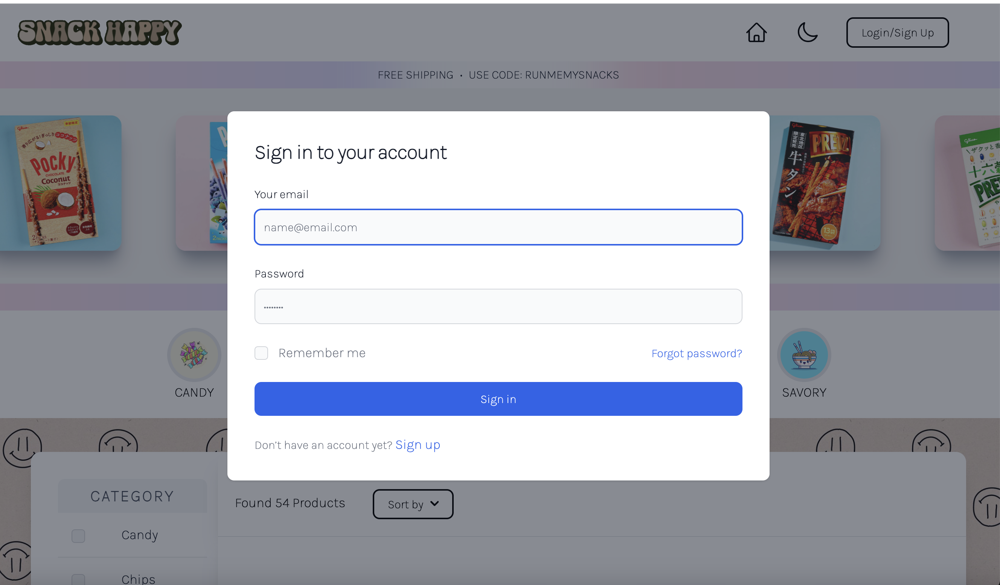
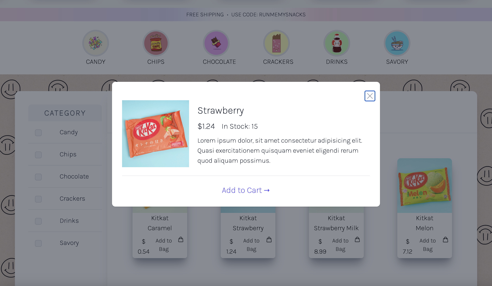

# shopie

## Description
The motive behind this project was to build a MERN Stack single page application. We created an ecommerce website using tailwind / flowbite components. Our backend was accomplished through the usage of apollo, bcrypt, dotenv, express, graphQL, jsonwebtoken, and mongoose. 
 
## Installation
1. Clone from repo.
2. Open folder with visual studio code or any text editor of choice.
3. Run 'npm i' to install packages
5. Run 'npm run seed' to seed data
4. Run 'npm run dev' to start the application.

## Usage
1. Open repo in terminal.
2. Run 'npm i' to install packages
3. Run 'npm run seed' to seed data
4. Run 'npm run dev' to start the application.
5. Login/Sign up through link in the Nav bar.
6. Check boxes under Category to fitler through products.

This is the Home Page view. From here, we can navigate to all products. The marquee displays the products in a fluid motion where visitors can see the products available. There are two options to sort through the categories of the products. The category bubbles will allow for easy access to one category of products. The category checkboxes allow for the viewers to click multiple products they would like to see. The home page shows where one can sign in or log in. 

The sign in modal is easy to use and allows new users to save their log in information for future uses. 

If one desires to learn more about each product, they can simply click on the product and a modal will pop up with more information describing the selected product. 

## Video Demo Link
[Click here for deployed link](https://damp-bayou-26639-6c0434c98fff.herokuapp.com/)